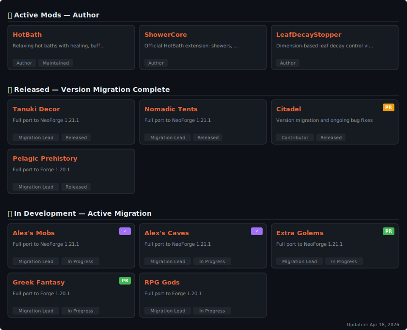

# Alex — Minecraft Mod Developer & Full-stack Engineer

---

<!-- Mod Cards (Visual Display) -->
<picture>
  <source media="(prefers-color-scheme: dark)" srcset="./assets/mods-card-dark.svg" />
  <source media="(prefers-color-scheme: light)" srcset="./assets/mods-card-light.svg" />
  
</picture>

<!-- Quick Links (Clickable) -->

---

<picture>
  <source media="(prefers-color-scheme: dark)" srcset="./assets/github-snake-dark.svg" />
  <source media="(prefers-color-scheme: light)" srcset="./assets/github-snake.svg" />
  
</picture>

<picture>
  <source media="(prefers-color-scheme: dark)" srcset="https://github-readme-activity-graph.vercel.app/graph?username=crabsatellite&custom_title=Contribution%20Graph&theme=github-dark&hide_border=true&line=F16436&point=ED8B00" />
  <source media="(prefers-color-scheme: light)" srcset="https://github-readme-activity-graph.vercel.app/graph?username=crabsatellite&custom_title=Contribution%20Graph&theme=github-light&hide_border=true&line=F16436&point=ED8B00" />
  
</picture>

  
   
  

