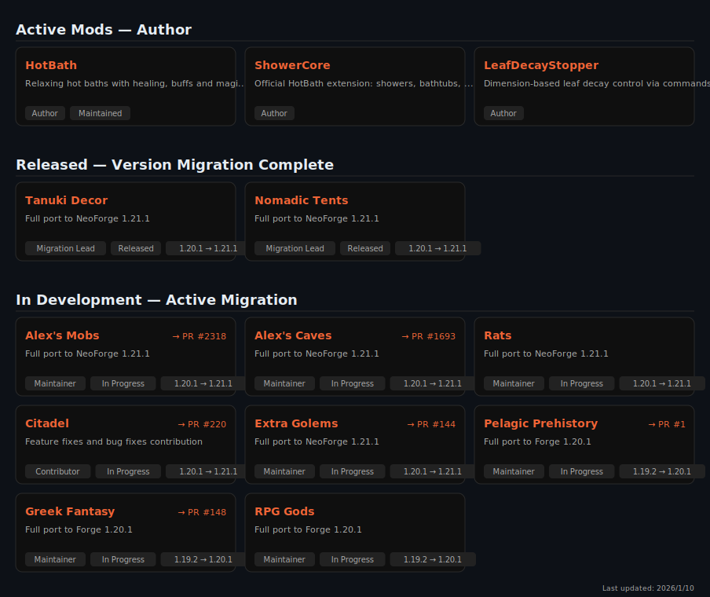

# Alex — Minecraft Mod Developer & Full-stack Engineer

---

<picture>
  <source media="(prefers-color-scheme: dark)" srcset="./assets/mods-card.svg" />
  <source media="(prefers-color-scheme: light)" srcset="./assets/mods-card.svg" />
  
</picture>

---

<picture>
  <source media="(prefers-color-scheme: dark)" srcset="./assets/github-snake-dark.svg" />
  <source media="(prefers-color-scheme: light)" srcset="./assets/github-snake.svg" />
  
</picture>

