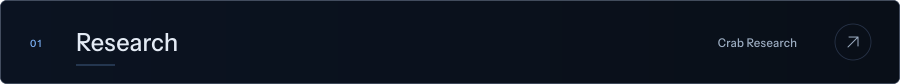
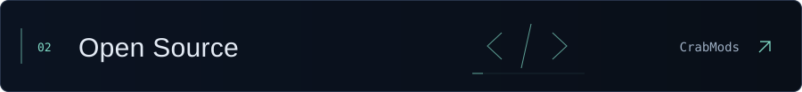
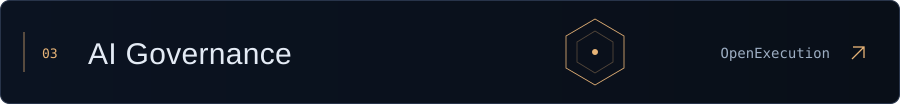

<!-- Generated by .github/scripts/generate-profile.mjs from data/profile.json. -->

  <a href="https://crabsatellite.com/">Crab Satellite</a> &nbsp; · &nbsp;
  <a href="https://www.linkedin.com/in/alex-li-13b585263/">LinkedIn</a> &nbsp; · &nbsp;
  <a href="https://github.com/crabsatellite/modporter">ModPorter</a>

