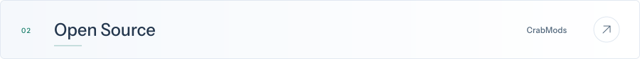
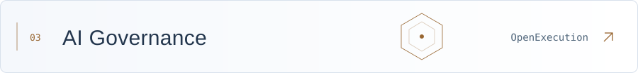

<!-- Generated by .github/scripts/generate-profile.mjs from data/profile.json. -->
<a href="https://crabsatellite.com/">
  <picture>
    <source media="(prefers-color-scheme: dark)" srcset="./assets/constellation.svg" />
    <source media="(prefers-color-scheme: light)" srcset="./assets/beach.svg" />
    
  </picture>
</a>

<a href="https://crabresearch.com/">
  <picture>
    <source media="(prefers-color-scheme: dark)" srcset="./assets/portal-research.svg" />
    <source media="(prefers-color-scheme: light)" srcset="./assets/portal-research-light.svg" />
    
  </picture>
</a>

<a href="https://crabmods.com/">
  <picture>
    <source media="(prefers-color-scheme: dark)" srcset="./assets/portal-opensource.svg" />
    <source media="(prefers-color-scheme: light)" srcset="./assets/portal-opensource-light.svg" />
    
  </picture>
</a>

<a href="https://openexecution.dev/">
  <picture>
    <source media="(prefers-color-scheme: dark)" srcset="./assets/portal-governance.svg" />
    <source media="(prefers-color-scheme: light)" srcset="./assets/portal-governance-light.svg" />
    
  </picture>
</a>

  <a href="https://crabsatellite.com/">Crab Satellite</a> &nbsp; · &nbsp;
  <a href="https://www.linkedin.com/in/alex-li-13b585263/">LinkedIn</a> &nbsp; · &nbsp;
  <a href="https://github.com/crabsatellite/modporter">ModPorter</a>

